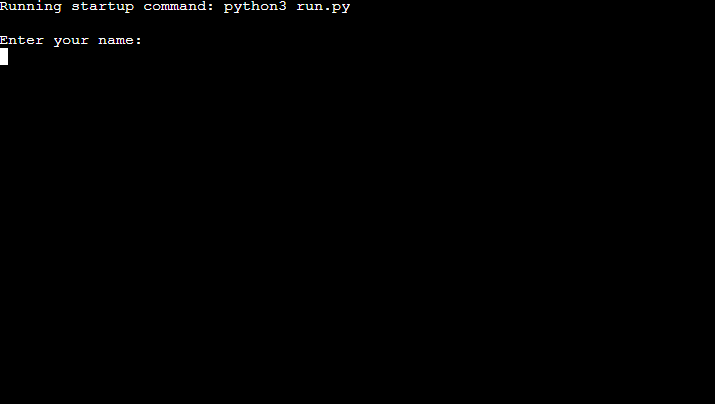
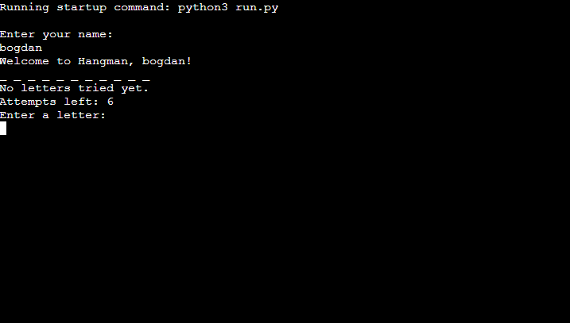
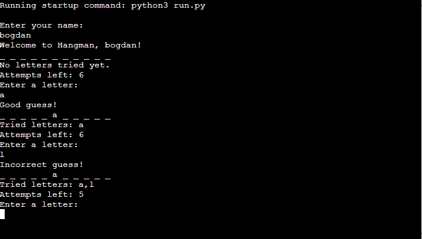
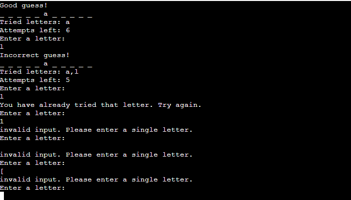
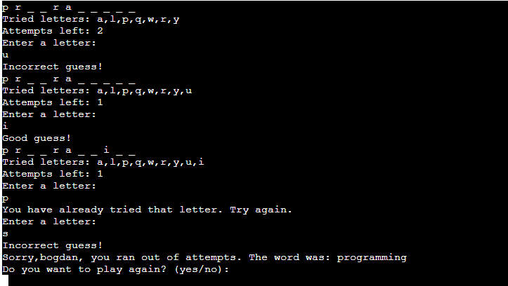

# Hangman Game (Python Game)

Hangman Game is a Python terminal game, which runs in the Code Institute mock terminal on Heroku.
Users can try and guess a random word by entering letters. You have 6 attempts to find the right letters.

The live version of my project can be viewed here [Python terminal](https://hangmanproject-fe865589899f.herokuapp.com/).

## How to Play

Hangman Game is based on the clasic pen-and-paper game. The classic game needed 2 or more players. One of the players thinks of a word and the other player has to guess it by suggesting letter within a number of attempts.

In this version the player is prompted to enter his name and the computer will pick a random word from a list.
The word will be printed with '_' instead of the letters.
The playes has 6 attempts to guess the word by suggesting letters. If the letter is wright the word will update with the guessed letter instead of '_'.
If the player will guess the word within the 6 attempts will be congratulated and asked if he wishes to play again.
If the player will not guess the word within the 6 attempts given it will let the users know that the word has not been guessed and show the player what the word was. The player will be asked if he wants to play again.

## Features

### Existing features

- The users is asked to enter his name

- The user is greeted to the game and a random word is picked
    - A random word is picked by the game from a list of words
    - The user can see the length of the word as each letter is replaced with a '_'
    - It let's the user know that no letters have been tried yet
    - It tells the user how many attempts are left

- Accepts user input
- Keeps track of the attempts left

- Input validation and error checking
    - You cannot enter anything but letters
    - You can not enter an empty space
    - It tells the user the letters tried allready
    - You can not enter the same guess twice

- Get asked at the end of the game if you wish to play again
    - Is yes the game will start again
    - If no the game will stop

### Future features
- Add levels of difficulty
- Add visual progress for the incorrect guesses by building a hangman

## Testing
